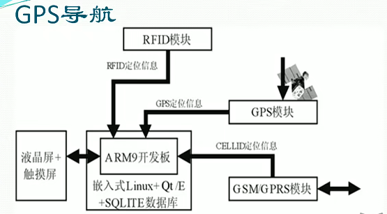

# 开始学习QT

## QT4

### 命名和类图（Q+类功能名）

QObject QWidget(图形类window-get) QTcpSocket QFontDialog 。。。

类多不慌，Qt的20%的类会被80%的使用到

## QT5.9.1

工具虚拟机：VMware

操作系统：windows 7

下载地址：https://download.qt.io/archive/qt/5.9/5.9.1/

